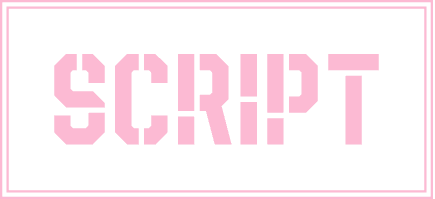

 <a href="./README.md">English</a> | 简体中文

vscode 插件 将当前项目下的脚本命令可视化，点击即可执行

## 💪 Support
- yarn
- npm
- pnpm
- Makefile

### Dark:

### Light:

## :coffee:

[请我喝一杯咖啡](https://github.com/Simon-He95/sponsor)

## License

[MIT](./license)
